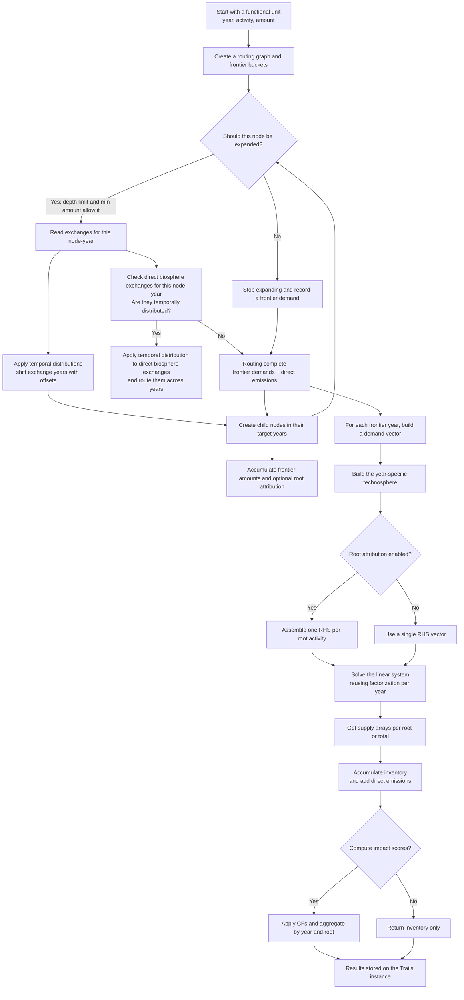
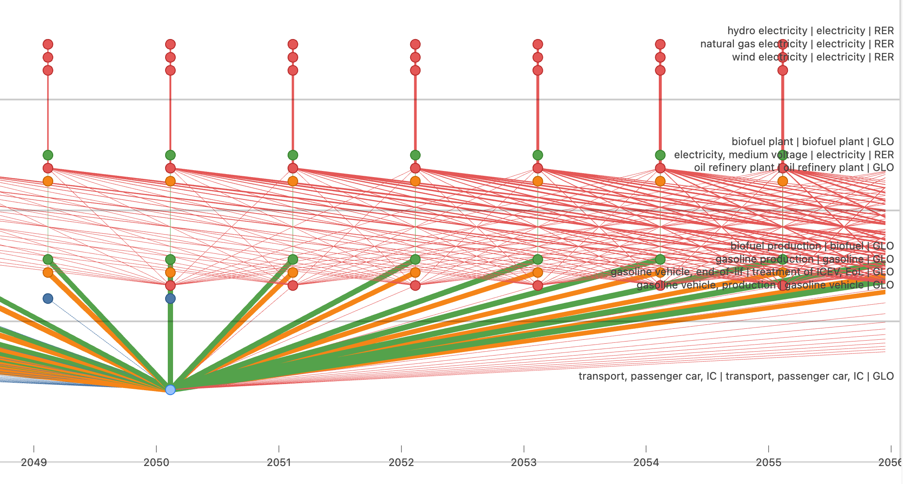
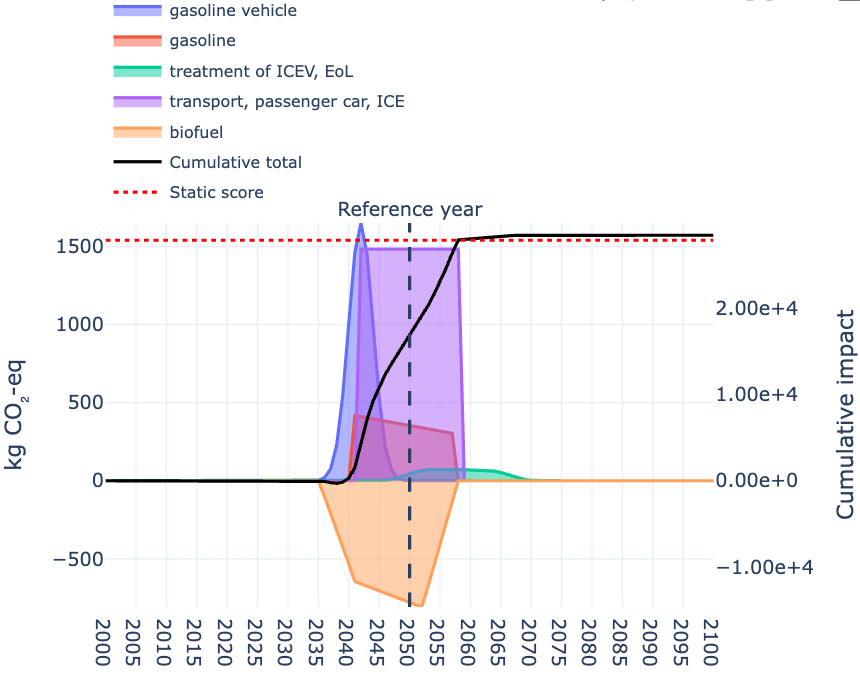
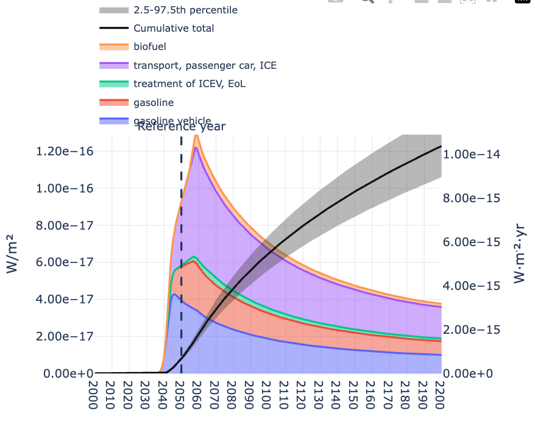
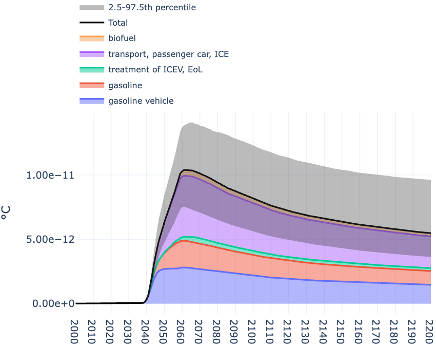

# `TRAILS`: Temporal Routing and Aggregation of Impacts across Life-cycle Systems


<p align="center">
  
</p>

[](https://badge.fury.io/py/trails)
[](https://anaconda.org/romainsacchi/trails)
[](LICENSE.md)
[](https://github.com/Laboratory-for-Energy-Systems-Analysis/trails/actions/workflows/main.yml)

`TRAILS` is a Python library for **temporal Life Cycle Assessment (LCA)**. It
models **time-resolved supply chains** where technosphere and biosphere exchanges can occur at
different points in time and across **scenario years**. This makes it possible to compute
how impacts evolve over time, attribute them to responsible activities, and compare scenarios.

Online documentation: [https://trails.readthedocs.io/en/latest/](https://trails.readthedocs.io/en/latest/)

At a high level, `TRAILS`:

* Effortlessly handles **deep temporalization** — temporal distributions can occur
  at any level of the supply chain, not just the foreground model.
* Loads **3D technosphere/biosphere matrices** (time, activity, products) from a
  Frictionless data package.
* **Interpolates** scenario matrices data points to annual resolution.
* Solves the inventory **sequentially, year by year**, avoiding a single massive
  technosphere solve.
* Runs a **temporal traversal** of the supply chain from a functional unit to build
  time-indexed demands.
* Solves year-specific systems and **routes impacts** through temporal distributions.
* Aggregates impacts by year, activity, and optional root attribution for analysis and plotting.

TRAILS is initially designed to consume ``premise``-generated data packages, which provide
year-specific background inventories and temporal distributions. This enables a single,
deeply-temporalized, technosphere representation.

`TRAILS` is compatible with Frictionless data packages produced by `premise`.



**Caption:** Temporal distributions shift the **anchor year** by integer offsets to produce
target years (e.g., `year + offset`). Offsets are clamped to available scenario years when
needed. The field `temporal_amount_source` controls how amounts are applied over time:
**`port`** uses the exchange amount directly (ported value), while **`matrix`** uses
the values stored in the year-specific matrices for the target years.

---

## Example Outputs

Example output for a gasoline passenger car driven 200,000 km (reference year 2050)
with a prospective background: the temporal supply-chain graph above, followed by
the resulting GWP, radiative forcing, and temperature anomaly time series.

<p align="center">
  
</p>


<table>
  <tr>
    <td align="center">
      
      <br/>
      Temporal GWP100
    </td>
    <td align="center">
      
      <br/>
      Radiative forcing
    </td>
    <td align="center">
      
      <br/>
      Temperature anomaly
    </td>
  </tr>
</table>

---

## Example Notebooks

Tutorial notebooks are available under `examples/`:

- `examples/1. simple numerical example.ipynb`
- `examples/2. premise and imported lci example.ipynb`

These walk through a full workflow (data loading, routing, LCA, plotting, and
[FaIR](https://github.com/OMS-NetZero/FAIR)-based climate metrics).

---

## Usage

Below is a minimal example that loads a Frictionless data package, runs a
temporal LCA, and plots the resulting impact time series.

```python
from datapackage import Package

from trails import Trails, lca, get_lcia_method_names, plot_temporal_scores

# Load a Frictionless data package exported by premise (or compatible tooling)
package = Package("path/to/datapackage.json")

# Initialize the TRAILS wrapper (with optional annual interpolation)
trails = Trails(package, interpolate_annual=True)

# Pick an activity index from the metadata
activity_indices = next(iter(trails.activity_indices.values()))
start_act_idx = next(iter(activity_indices.keys()))

# Choose an LCIA method bundled with TRAILS
method = get_lcia_method_names(ei_version="3.11")[0]

# Run temporal routing (builds the traversal graph)
trails.temporal_routing(
    start_year=2030,
    start_act_idx=start_act_idx,
    max_depth=2,
)

# Run temporal LCA (stores scores on trails.scores)
lca(
    trails=trails,
    methods=[method],
)

# Plot temporal impact scores
fig = plot_temporal_scores(trails, method_label=method)
fig.show()
```

---


## Importing Excel Inventories

You can import user-provided inventories from Excel using ``bw2io``.
```python
from trails import Trails

trails = Trails(package)
trails.import_excel_inventory("path/to/inventory.xlsx")

# Target a single scenario slice instead
trails.import_excel_inventory("path/to/inventory.xlsx", year=2020)
```

### Year-specific amounts

You can provide **year-specific amounts** directly in the Excel exchanges by
adding integer year columns (e.g., `2010`, `2020`, `2030`, `2050`). These values
are written to the corresponding years in `A`/`B`, and TRAILS interpolates
between them across annual years as usual. If no year-specific columns are
present, the importer uses the standard `amount` field.


## [FaIR](https://github.com/OMS-NetZero/FAIR) Climate Model Integration

TRAILS can translate time-resolved inventories into radiative forcing and
temperature anomalies using the [FaIR](https://github.com/OMS-NetZero/FAIR) climate model. The workflow runs a baseline
[FaIR](https://github.com/OMS-NetZero/FAIR) scenario and performs per-species perturbations derived from the Trails
inventory. Positive and negative emissions are treated separately to preserve
long-lived CO2 tails for both uptake and release. Results are allocated to root
activities using cumulative signed emissions for each (flow, root) pair and
stored as ``trails.instant_radiative_forcing`` and ``trails.delta_temperature``.

Key components:

* Emissions baseline from the bundled REMIND/[FaIR](https://github.com/OMS-NetZero/FAIR) IAMC CSV
* Flow-to-species mapping via ``data/scenarios/fair_species_map.yaml``
* Per-species [FaIR](https://github.com/OMS-NetZero/FAIR) runs with optional auto-scaling
* All [FaIR](https://github.com/OMS-NetZero/FAIR) configs are evaluated; quantiles (2.5, 25, 50, 75, 97.5) are stored
* Output dims: ``(quantile, year, flow, root activity)``
* Units: ``W/m²`` for radiative forcing and ``°C`` for temperature anomaly

Example:

```python
from trails.fair_rf import run_fair_delta_rf
from trails import plot_rf, plot_temp

rf = run_fair_delta_rf(
    trails,
    scenario="high-extension",
)

# Quantile outputs are stored on the Trails instance
rf = trails.instant_radiative_forcing  # (quantile, year, flow, root activity)
temp = trails.delta_temperature        # (quantile, year, flow, root activity)

# Plotting defaults to the 50th quantile
plot_rf(trails, year_range=(2000, 2100))
plot_temp(trails, year_range=(2000, 2100))
```

## Method Overview

`TRAILS` extends classic LCA by making time an explicit dimension. Temporal exchanges are
encoded using distributions (e.g., discrete, normal, lognormal, uniform, triangular)
and expanded into year offsets during traversal. For each calendar year that becomes active
in the traversal frontier, the system matrix is solved, and biosphere flows are accumulated
at their respective years. Impacts are then characterized using LCIA methods bundled with
the library, producing time series of impact scores.

The key modeling steps are:

1. **Load package data**: technosphere/biosphere matrices and metadata.
2. **Temporal traversal**: propagate demands across time using exchange distributions.
3. **Per-year solving**: build year-specific systems and compute supply vectors.
4. **Impact attribution**: accumulate impacts by year and (optionally) by root activity.

## Motivation

Conventional LCA frameworks treat time implicitly or exogenously. Impacts are typically 
computed for a single static system, even when future scenarios or dynamic technologies 
are considered.

`TRAILS` addresses this limitation by introducing:

* Handling of **temporal dimensions** in technosphere and biosphere matrices  
* **Time-aware routing of exchanges** across supply chains  
* **Scenario-dependent inventories and impacts**  

Instead of asking *“What is the impact of this system?”*, `TRAILS` allows you to ask:

> *When do impacts occur across the life cycle?*

---

## Core Concepts

### 1. Temporal graph traversal
Life-cycle systems are represented as **time-indexed graphs**, where exchanges may occur at 
different points in time relative to the functional unit.

### 2. Routing of impacts
Impacts are **routed along supply-chain paths**, allowing attribution to:
* specific suppliers,
* specific time periods,
* specific traversal depths.

### 3. Aggregation across scenarios and horizons
Impacts can be aggregated or compared across:
* years (e.g., 2020 → 2050 → 2100),
* scenarios (e.g., SSPs, decarbonization pathways),
* temporal horizons (short-term vs long-term effects).

---

## Key Features

* Temporal LCA engine with explicit time handling  
* Deep supply-chain traversal  
* Scenario-aware computation and aggregation across years

---

## Data Package Expectations

`TRAILS` consumes Frictionless data packages with:

* **Matrices**: technosphere (A) and biosphere (B) CSVs with required columns such as
  `index of activity`, `index of product` / `index of biosphere flow`, `value`, and
  uncertainty fields (`loc`, `scale`, `shape`, `minimum`, `maximum`, `negative`, `flip`).
* **Temporal columns** (optional): `temporal_distribution`, `temporal_loc`,
  `temporal_scale`, `temporal_min`, `temporal_max`, `temporal_amount_source`.
* **Metadata**: activity and biosphere indices per scenario label (year).

Packages exported by the `premise.TrailsDataPackage` class follow this structure out of the box.

## Architecture Overview

Core modules and responsibilities:

* `trails/datapackage.py`: load matrices, indices, and temporal metadata.
* `trails/trails.py`: main wrapper, temporal traversal, inventory/score accumulation.
* `trails/lca.py`: orchestration of traversal + per-year solves using `bw2calc`.
* `trails/lcia.py`: bundled LCIA methods and characterization factor matrices.
* `trails/plotting.py`: time-series visualization helpers.

## FAQ

**What is a temporal exchange?**  
An exchange with a distribution over year offsets (e.g., lognormal), expanded into
discrete year pulses during traversal.

**How are years handled?**  
Scenario labels are treated as calendar years. When a year is requested that does not
exist in the package, the nearest available scenario year is used.

**Do I need both scores and inventory?**  
By default `lca()` computes scores and stores them on `trails.scores`. If you set
`compute_score=False`, pass `store_inventory=True` and use
`trails.characterized_inventory` for plotting. Remember to run
`trails.temporal_routing(...)` before `lca()`.

## Limitations & Assumptions

* Input data must follow the expected Frictionless schema; missing columns will fail fast.
* Years are treated as discrete calendar years (no sub-annual resolution).
* If a requested year is not available, the nearest scenario year is used.
* Some tests or workflows may require external LCA data (e.g., ecoinvent) not shipped here.

---

## Installation

```bash
pip install trails
```

---

## Solver Performance Notes

`TRAILS` relies on `bw2calc` for linear system solves. Performance depends on the
available sparse solver backend:

- **PC users**: `bw2calc` will use `pypardiso` with **MKL’s PARDISO** solver (fast).
- **Mac users with ARM chips**: install `scikit-umfpack` to enable **UMFPACK**. Without
  it, the solver falls back to SciPy’s default, which is significantly slower.

To enable `pypardiso` on PCs:

```bash
pip install pypardiso
```

or, using conda:

```bash
conda install -c conda-forge pypardiso
```


To enable UMFPACK on ARM Macs:

```bash
pip install scikit-umfpack
```

or, using conda:

```bash
conda install -c conda-forge scikit-umfpack
```

## Documentation

https://trails.readthedocs.io/en/latest/index.html

---

## Authors

- [Romain Sacchi](mailto:romain.sacchi@psi.ch)

## License

MIT License.
