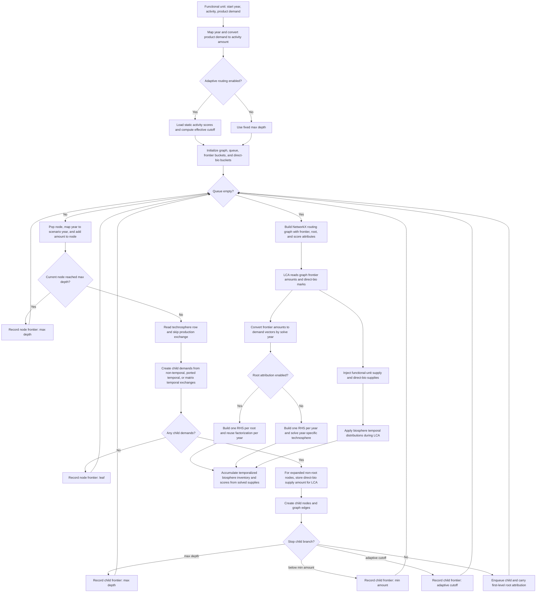

# `TRAILS`: Temporal Routing and Aggregation of Impacts across Life-cycle Systems


<p align="center">
  
</p>

[](https://badge.fury.io/py/trails-lca)
[](https://anaconda.org/romainsacchi/trails-lca)
[](LICENSE.md)
[](https://github.com/Laboratory-for-Energy-Systems-Analysis/trails/actions/workflows/main.yml)

`TRAILS` is a Python library for **temporal Life Cycle Assessment (LCA)**. It
models **time-resolved supply chains** where technosphere and biosphere exchanges can occur at
different points in time and across **scenario years**. This makes it possible to compute
how impacts evolve over time, attribute them to responsible activities, and compare scenarios.

Online documentation: [https://trails.readthedocs.io/en/latest/](https://trails.readthedocs.io/en/latest/)

At a high level, `TRAILS`:

* Effortlessly handles **deep temporalization** — temporal distributions can occur
  at any level of the supply chain, not just the foreground model.
* Loads **3D technosphere/biosphere matrices** (time, activity, products) from a
  Frictionless data package.
* **Interpolates** scenario matrices data points to annual resolution.
* Solves the inventory **sequentially, year by year**, avoiding a single massive
  technosphere solve.
* Runs a **temporal traversal** of the supply chain from a functional unit to build
  time-indexed demands.
* Supports **adaptive temporal routing** using a relative static LCIA
  score-potential cutoff, so low-potential branches can remain matrix-solved
  frontier demands instead of being expanded explicitly.
* Solves year-specific systems and **routes impacts** through temporal distributions.
* Can score temporal inventories with optional **EDGES regionalized
  characterization factors**.
* Aggregates impacts by year, activity, and optional root attribution for analysis and plotting.

TRAILS is initially designed to consume ``premise``-generated data packages, which provide
year-specific background inventories and temporal distributions. This enables a single,
deeply-temporalized, technosphere representation.

`TRAILS` is compatible with Frictionless data packages produced by `premise`.


## Algorithm Overview



**Caption:** Temporal technosphere distributions first produce raw pulse years
(`year + offset`). Routing maps those years to available scenario years by clipping
to the model horizon and, on non-annual grids, snapping to the nearest scenario year.
The field `temporal_amount_source` controls how amounts are applied over time:
**`port`** splits the anchor-year exchange amount across pulse weights, while
**`matrix`** rereads the exchange coefficient from each pulse scenario year before
applying the weight. Branches stopped by `max_depth`, `min_amount`, leaf status, or
the adaptive score-potential cutoff remain frontier demand and are still solved by
`lci()`. Routing does not temporalize direct biosphere exchanges itself; it records
direct-bio supply amounts for expanded non-root nodes, and `lci()` applies
biosphere temporal distributions while accumulating the inventory.

---

## Example Outputs

Example output for a gasoline passenger car driven 200,000 km (reference year 2050)
with a prospective background: the temporal supply-chain graph above, followed by
the resulting GWP, radiative forcing, and temperature anomaly time series.

<p align="center">
  
</p>


<table>
  <tr>
    <td align="center">
      
      <br/>
      Temporal GWP100
    </td>
    <td align="center">
      
      <br/>
      Radiative forcing
    </td>
    <td align="center">
      
      <br/>
      Temperature anomaly
    </td>
  </tr>
</table>

---

## Example Notebooks

Tutorial notebooks are available under `examples/`:

- `examples/1. simple numerical example.ipynb`
- `examples/2.1. generate Trails data package.ipynb`
- `examples/2.2. premise and imported lci example.ipynb`
- `examples/2.3. fixed depth vs adaptive routing imported lci.ipynb`

These walk through a full workflow (data loading, routing, LCA, plotting, and
[FaIR](https://github.com/OMS-NetZero/FAIR)-based climate metrics).

---

## Usage

Below is a minimal example that loads a Frictionless data package, runs a
temporal LCA, and plots the resulting impact time series.

```python
from datapackage import Package

from trails import (
    Trails,
    get_lcia_method_names,
    plot_temporal_scores,
    plot_adaptive_sankey,
)

# Load a Frictionless data package exported by premise (or compatible tooling)
package = Package("path/to/datapackage.json")

# Choose an LCIA method bundled with TRAILS
method = get_lcia_method_names(ei_version="3.11")[0]

# Initialize TRAILS with annual interpolation.
# By default, annual years are extended by one year on each side
# (min_year-1 to max_year+1) using endpoint duplication.
trails = Trails(
    package,
    interpolate_annual=True,
    ei_version="3.11",
)

# Optional: wider padding, e.g., 20 years before/after
# trails = Trails(
#     package,
#     interpolate_annual=True,
#     interpolation_start_year_offset=-20,
#     interpolation_end_year_offset=20,
#     ei_version="3.11",
# )

# Pick an activity index from the metadata
activity_indices = next(iter(trails.activity_indices.values()))
start_act_idx = next(iter(activity_indices.keys()))

# Run temporal routing (builds the traversal graph).
# By default this uses adaptive routing with a relative cutoff of 1e-4.
trails.temporal_routing(
    start_year=2030,
    start_act_idx=start_act_idx,
    adaptive_methods=[method],
)

# Build the temporal inventory once
trails.lci(
    solver_mode="iterative",
    iterative_rtol=1e-3,
)

# Characterize the same inventory as many times as needed
scores = trails.lcia(methods=[method])

# Plot temporal impact scores
fig = plot_temporal_scores(trails, method_label=method)
fig.show()

# Plot the explicit adaptive routed graph as a depth/year Sankey
sankey = plot_adaptive_sankey(
    trails,
    method=method,
    branch_visual_cutoff=0.001,
)
sankey.show()
```

---

### Temporal routing modes

`temporal_routing()` is adaptive by default. The default cutoff is a relative
score-potential cutoff of `1e-4`, meaning that a branch can stop being expanded
explicitly once its estimated static score potential is at most 0.01% of the
functional unit's static score potential. Stopped branches remain frontier
demands and are still included in the year-wise matrix solve.

```python
# 1. Default adaptive routing
trails.temporal_routing(
    start_year=2030,
    start_act_idx=start_act_idx,
    adaptive_methods=[method],
)

# 2. Adaptive routing with a different relative cutoff
trails.temporal_routing(
    start_year=2030,
    start_act_idx=start_act_idx,
    adaptive_methods=[method],
    adaptive_relative_score_cutoff=1e-5,
)

# 3. Adaptive routing with a hard depth cap
trails.temporal_routing(
    start_year=2030,
    start_act_idx=start_act_idx,
    max_depth=5,
    adaptive_methods=[method],
    adaptive_relative_score_cutoff=1e-4,
)

# 4. Fixed-depth routing
trails.temporal_routing(
    start_year=2030,
    start_act_idx=start_act_idx,
    max_depth=3,
)
```

Adaptive routing requires explicit regular ``adaptive_methods``. These screening
methods are independent of the regular or EDGES methods later passed to
``lcia()``.

---

### Adaptive Sankey plotting

`plot_adaptive_sankey()` visualizes the explicit graph created by adaptive
`temporal_routing()`. Link widths use the routed child node's static
score-potential contribution, nodes are arranged horizontally by routing depth
and vertically by year, and labels are available on hover. Matrix-solved
frontier demands are included in the LCA, but only explicitly routed graph
edges appear in the Sankey.

```python
from trails import plot_adaptive_sankey

trails.temporal_routing(
    start_year=2030,
    start_act_idx=start_act_idx,
    adaptive_methods=[method],
    adaptive_relative_score_cutoff=1e-4,
)

fig = plot_adaptive_sankey(
    trails,
    method=method,
    branch_visual_cutoff=0.001,
    max_sankey_links=0,  # no hard link cap
    output_path="adaptive_sankey.html",
)
fig.show()
```

The same plot is also available as a convenience method:

```python
fig = trails.plot_adaptive_sankey(method=method)
```

---

### Optional EDGES regionalized LCIA

TRAILS can score the finalized temporal inventory with
[EDGES](https://github.com/Laboratory-for-Energy-Systems-Analysis/edges)
edge-level characterization factors. This is optional; normal LCIA methods do
not require the ``edges`` package.

```python
from trails import Trails, get_edges_lcia_method_names

edges_method = get_edges_lcia_method_names()[0]

trails_edges = Trails(package, interpolate_annual=True)
trails_edges.temporal_routing(
    start_year=2030,
    start_act_idx=start_act_idx,
    max_depth=3,
)
trails_edges.lci()
edge_scores = trails_edges.lcia(
    methods=[edges_method],
    method_backend="edges",
    reuse_mappings=True,
)
```

With the default ``reuse_mappings=True``, TRAILS reuses EDGES matched CF
templates across temporal inventory years when supplier and consumer metadata
signatures are identical. TRAILS passes each actual inventory year to EDGES as
``scenario_idx``, so prospective AWARE factors and their interpolation remain
year-specific even if the Trails A/B matrices use a nearby database scenario
year. Set
``reuse_mappings=False`` to force EDGES matching independently for every
year, for example if an EDGES method changes which CF row matches an exchange
based on the year.

---


## Importing Excel Inventories

You can import user-provided inventories from Excel using ``bw2io``.
```python
from trails import Trails

trails = Trails(package)
trails.import_excel_inventory("path/to/inventory.xlsx")

# Target a single scenario slice instead
trails.import_excel_inventory("path/to/inventory.xlsx", year=2020)
```

### Year-specific amounts

You can provide **year-specific amounts** directly in the Excel exchanges by
adding integer year columns (e.g., `2010`, `2020`, `2030`, `2050`). These values
are written to the corresponding years in `A`/`B`, and TRAILS interpolates
between them across annual years as usual. If no year-specific columns are
present, the importer uses the standard `amount` field.


## [FaIR](https://github.com/OMS-NetZero/FAIR) Climate Model Integration

TRAILS can translate time-resolved inventories into radiative forcing and
temperature anomalies using the [FaIR](https://github.com/OMS-NetZero/FAIR) climate model. The workflow runs a baseline
[FaIR](https://github.com/OMS-NetZero/FAIR) scenario and performs per-species perturbations derived from the Trails
inventory. Positive and negative emissions are treated separately to preserve
long-lived CO2 tails for both uptake and release. Results are allocated to root
activities using cumulative signed emissions for each (flow, root) pair and
stored as ``trails.instant_radiative_forcing`` and ``trails.delta_temperature``.

Key components:

* Emissions baseline from the bundled REMIND/[FaIR](https://github.com/OMS-NetZero/FAIR) IAMC CSV
* Flow-to-species mapping via ``data/scenarios/fair_species_map.yaml``
* Per-species [FaIR](https://github.com/OMS-NetZero/FAIR) runs with optional auto-scaling
* All [FaIR](https://github.com/OMS-NetZero/FAIR) configs are evaluated; quantiles (2.5, 25, 50, 75, 97.5) are stored
* Output dims: ``(quantile, year, flow, root activity)``
* Units: ``W/m²`` for radiative forcing and ``°C`` for temperature anomaly

Example:

```python
from trails.fair_rf import run_fair_delta_rf
from trails import plot_rf, plot_temp

rf = run_fair_delta_rf(
    trails,
    scenario="REMIND|SSP2-PkBudg650",
    # defaults shown explicitly:
    per_species_runs=True,
    per_species_workers=None,  # auto: min(4, cpu_count, n_work_items)
)

# Quantile outputs are stored on the Trails instance
rf = trails.instant_radiative_forcing  # (quantile, year, flow, root activity)
temp = trails.delta_temperature        # (quantile, year, flow, root activity)

# Plotting defaults to the 50th quantile
plot_rf(trails, year_range=(2000, 2100))
plot_temp(trails, year_range=(2000, 2100))
```

Notes:

* ``run_fair_delta_rf`` requires ``trails.inventory`` with
  ``root activity`` attribution. Run ``lci()`` after ``temporal_routing(...)``
  before calling FaIR.
* ``scenario`` must match a scenario label present in the emissions CSV used by
  ``run_fair_delta_rf`` (bundled default uses REMIND/FaIR data).
* If you don't pass ``config_name`` or ``config_names``, TRAILS evaluates all
  available FaIR configurations and stores quantiles across the ensemble.

## Method Overview

`TRAILS` extends classic LCA by making time an explicit dimension. Temporal exchanges are
encoded using distributions (e.g., discrete, normal, lognormal, uniform, triangular,
discrete empirical)
and expanded into year offsets during traversal. For each calendar year that becomes active
in the traversal frontier, the system matrix is solved, and biosphere flows are accumulated
at their respective years. Impacts are then characterized using LCIA methods bundled with
the library, producing time series of impact scores.

The key modeling steps are:

1. **Load package data**: technosphere/biosphere matrices and metadata.
2. **Temporal traversal**: propagate demands across time using exchange distributions.
3. **Per-year solving**: build year-specific systems and compute supply vectors.
4. **Impact attribution**: accumulate impacts by year and (optionally) by root activity.

## Motivation

Conventional LCA frameworks treat time implicitly or exogenously. Impacts are typically 
computed for a single static system, even when future scenarios or dynamic technologies 
are considered.

`TRAILS` addresses this limitation by introducing:

* Handling of **temporal dimensions** in technosphere and biosphere matrices  
* **Time-aware routing of exchanges** across supply chains  
* **Scenario-dependent inventories and impacts**  

Instead of asking *“What is the impact of this system?”*, `TRAILS` allows you to ask:

> *When do impacts occur across the life cycle?*

---

## Core Concepts

### 1. Temporal graph traversal
Life-cycle systems are represented as **time-indexed graphs**, where exchanges may occur at 
different points in time relative to the functional unit.

### 2. Routing of impacts
Impacts are **routed along supply-chain paths**, allowing attribution to:
* specific suppliers,
* specific time periods,
* specific traversal depths.

### 3. Aggregation across scenarios and horizons
Impacts can be aggregated or compared across:
* years (e.g., 2020 → 2050 → 2100),
* scenarios (e.g., SSPs, decarbonization pathways),
* temporal horizons (short-term vs long-term effects).

---

## Key Features

* Temporal LCA engine with explicit time handling  
* Deep supply-chain traversal  
* Scenario-aware computation and aggregation across years

---

## Data Package Expectations

`TRAILS` consumes Frictionless data packages with:

* **Matrices**: technosphere (A) and biosphere (B) CSVs with required columns such as
  `index of activity`, `index of product` / `index of biosphere flow`, `value`, and
  uncertainty fields (`loc`, `scale`, `shape`, `minimum`, `maximum`, `negative`, `flip`).
* **Temporal columns** (optional): `temporal_distribution`, `temporal_loc`,
  `temporal_scale`, `temporal_min`, `temporal_max`, `temporal_amount_source`,
  `temporal_offsets`, `temporal_weights`.
* **Metadata**: activity and biosphere indices per scenario label (year).

Packages exported by the `premise.TrailsDataPackage` class follow this structure out of the box.

## Architecture Overview

Core modules and responsibilities:

* `trails/datapackage.py`: load matrices, indices, and temporal metadata.
* `trails/trails.py`: main wrapper, temporal traversal, inventory/score accumulation.
* `trails/lca.py`: orchestration of traversal + per-year solves (`iterative`,
  `direct`, or `bw2calc`; default is `iterative`).
* `trails/lcia.py`: bundled LCIA methods and characterization factor matrices.
* `trails/plotting.py`: time-series visualization helpers.

## FAQ

**What is a temporal exchange?**  
An exchange with a distribution over year offsets (e.g., lognormal), expanded into
discrete year pulses during traversal.

**How do I encode explicit pulses in specific years?**  
Use `temporal_distribution=6` with JSON-list columns:
`temporal_offsets` (e.g., `[0, 5, 12]`) and
`temporal_weights` (e.g., `[0.5, 0.3, 0.2]`).

**How are years handled?**  
Scenario labels are treated as calendar years. When a year is requested that does not
exist in the package, the nearest available scenario year is used.

**Do I need both scores and inventory?**  
``lci()`` always builds and retains ``trails.inventory``. A subsequent
``lcia(methods=[...])`` stores compact impact results on ``trails.scores`` and,
for regular methods, exposes a lazy or sparse ``trails.characterized_inventory``.
Repeated ``lcia()`` calls reuse the same inventory.

Large root-attributed direct or iterative inventories automatically use the
factorized backend when their predicted eager allocation exceeds the memory
budget. Other large inventories use bounded, disk-backed sparse storage.
``trails.inventory`` and ``trails.characterized_inventory`` remain
``xarray.DataArray`` objects; their data can be a Dask array of sparse COO blocks.
Buffered partitions are written into a fixed set of binary shard buckets, which
are compacted independently as they grow. Adjacent inventory years share both
storage partitions and Dask chunks. This bounds file count, reclaims duplicates
without a whole-inventory copy, and reduces scheduler overhead.
The default 256 MiB inventory working-memory budget can be changed explicitly:

```python
trails.lci(
    inventory_backend="auto",       # auto, coo, chunked, or factorized
    inventory_memory_budget=256 * 2**20,
    inventory_store=None,            # managed temporary store
)
```

TRAILS processes its own FaIR, EDGES, and plotting reductions one sparse block at
a time. Use ``materialize_inventory()`` or
``materialize_characterized_inventory()`` only when a single eager COO is needed;
both estimate the allocation and raise before exceeding the configured budget.
Call ``trails.close()`` (or use ``with Trails(...) as trails``) to remove managed
temporary blocks.

For classical LCIA, scores are reduced incrementally from the stored inventory.
Both ``trails.scores`` and ``trails.characterized_inventory`` remain available,
without rerunning the year-specific linear systems.

For the full BrightCon DACCS case, ``dev/profile_daccs_memory.py`` reproduces the
notebook pipeline in an isolated worker while a parent process samples runtime and
RSS. It terminates the worker if either its RSS ceiling is crossed or system-wide
available RAM falls below the configured reserve, and writes phase timings plus
inventory diagnostics to JSON:

```bash
python dev/profile_daccs_memory.py \
    --data-dir /path/to/BrightCon-2026/data \
    --output results/daccs_memory_profile.json \
    --rss-limit-gib 12 \
    --min-available-gib 1.5
```

``trails.lca_diagnostics`` separates total LCA phases, while
``trails.inventory_diagnostics`` reports append, online flush, final flush, and
merge time, plus the final storage-file and Dask-block counts. This makes
bounded-storage and scheduling overhead visible instead of attributing it to the
linear-system solver alone.

## Limitations & Assumptions

* Input data must follow the expected Frictionless schema; missing columns will fail fast.
* Years are treated as discrete calendar years (no sub-annual resolution).
* If a requested year is not available, the nearest scenario year is used.
* Some tests or workflows may require external LCA data (e.g., ecoinvent) not shipped here.

---

## Installation

```bash
pip install trails-lca
```

or:

```bash
conda install -c conda-forge -c romainsacchi trails-lca
```

The PyPI and conda distributions are named `trails-lca`; the Python import package remains
`trails`.

---

## Solver Performance Notes

`TRAILS` defaults to an iterative GMRES solve (`solver_mode="iterative"`) with
`iterative_rtol=1e-3`. You can also use `solver_mode="bw2calc"` or
`solver_mode="direct"` depending on your workflow.

For `bw2calc` and direct sparse-factorization paths, performance depends on the
available sparse solver backend:

- **PC users**: `bw2calc` will use `pypardiso` with **MKL’s PARDISO** solver (fast).
- **Mac users with ARM chips**: install `scikit-umfpack` to enable **UMFPACK**. Without
  it, the solver falls back to SciPy’s default, which is significantly slower.

To enable `pypardiso` on PCs:

```bash
pip install pypardiso
```

or, using conda:

```bash
conda install -c conda-forge pypardiso
```


To enable UMFPACK on ARM Macs:

```bash
pip install scikit-umfpack
```

or, using conda:

```bash
conda install -c conda-forge scikit-umfpack
```

## Documentation

https://trails.readthedocs.io/en/latest/index.html

---

## Authors

- [Romain Sacchi](mailto:romain.sacchi@psi.ch)

## License

MIT License.
